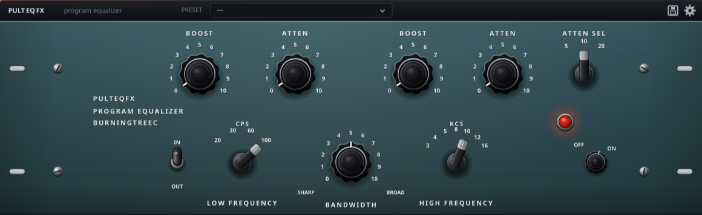

# PultEQFx

A circuit modelled passive program equalizer, built with
[NIH-plug](https://github.com/robbert-vdh/nih-plug). Builds as CLAP and VST3,
plus a standalone application for trying it out.

PultEQFx models the passive equalizer circuit of the classic 1950s tube program
equalizer, the Pultec® EQP-1A. It is not affiliated with, endorsed by, or
connected to Pulse Techniques, LLC; Pultec® and EQP-1A are their marks, used
here only to say which circuit is modelled.



## What it models

The original is a passive LC/RC equalizer followed by a tube make-up amplifier
that undoes the network's ~22 dB insertion loss. The passive network is
simulated as a circuit rather than approximated with a bank of shelving
filters, which matters because the boost and attenuate controls of each band
tap the same divider chain at different points. Using both at once is not two
filters added together, it is one network rearranged, and that is where the
"low end trick" comes from: boosting and attenuating the same low frequency
lifts the bottom and digs a dip an octave or two above it. The original manual
told you not to do it.

* **Topology and values** are taken from the original schematic: a 10k high boost
  pot with the LC tank bridged off its wiper, a 1k high attenuate pot shunting
  the top end to ground through the selected capacitor, a 100k low attenuate
  pot and a 10k low boost pot with their own pairs of frequency capacitors.
  Pot tapers follow the Pultec service documentation, so the low boost and low
  attenuate knobs are audio taper and the rest are linear. The knobs are
  calibrated 0 to 10 like the hardware, and the non-linear relationship between
  knob position and decibels falls out of the circuit rather than being dialled
  in by hand.
* **Solved per sample** by nodal analysis with trapezoidal companion models,
  the way SPICE solves a linear circuit. The conductance matrix only changes
  when a knob moves, so it is factorised at control rate and each sample costs
  one forward and one back substitution.
* **Frequency prewarped** per element, so the 16 kHz bell sits at 16 kHz even at
  a 44.1 kHz sample rate instead of sliding down towards Nyquist.
* **The make-up amplifier** contributes the rest of the character: mostly odd
  order harmonics from the push-pull stage with a little second order from its
  imbalance, plus the bandwidth limits of the iron at both ends. The `DRIVE`
  control is the one liberty taken with the hardware.

Measured against the published curves, with the tests in `tests/response.rs`
checking each one:

| Setting | Response |
| --- | --- |
| Low boost 10 @ 100 cps | +16.3 dB at 20 Hz |
| Low atten 10 @ 100 cps | −19.2 dB at 20 Hz |
| Low boost 10 + atten 10 @ 30 cps | +5.1 dB at 80 Hz, −4.2 dB at 200 Hz |
| High boost 10, sharp | +18.0 dB on the selected frequency |
| High boost 10, broad | +12.9 dB, wider |
| High atten 10 | −16 dB on the selected frequency |

## Controls

The front panel is the hardware's. The left hand toggle is the EQ IN/OUT
switch, which lifts the passive network out of circuit but leaves the amplifier
in it. The OFF/ON knob at the right takes the whole unit out of circuit, and
the pilot lamp follows it.

The strip above the panel is not on the hardware. It carries the preset drop
down, a save button and the settings button.

Presets are the panel's parameter values, minus the oversampling setting,
which is a choice about the machine rather than the sound. The loaded preset's
name is saved with the session, and an amber dot appears next to it as soon as
the panel no longer matches what was loaded. That is decided by comparing the
values rather than by tracking an edited flag, so turning a control back to
where it was clears the dot again. **Low End Punch** is
built in: the low end trick at 100 cps with a little 10 kc air, which measures
+7.7 dB at the bottom, +6.4 dB at 100 Hz, a scoop through 500 Hz and +6 dB of
air on top. Saving asks for a name and confirms before replacing an existing
preset. Saved presets are one JSON file each under
`~/.config/pulteqfx/presets`, so they can be copied between machines or
edited by hand; a saved preset that shares a name with a built-in one replaces
it in the list.

The settings button holds:

* **Window size**, from 50 % to 200 %. The panel is drawn as vector graphics, so
  every size is sharp.
* **Oversampling**, off through 8x. The equalizer is prewarped and accurate
  without it; oversampling is there for the amplifier's saturation. The plugin
  always reports 74 samples of latency and pads the shorter settings out to
  match, so switching quality never changes the reported latency while the
  host is running.
* **Drive** and **output** trim for the amplifier.

Knobs respond to drag, scroll, shift for a finer grip and double click to
reset.

## Building

Needs a Rust toolchain and the usual X11 development packages.

```sh
./install.sh
```

That builds the plugin and installs the CLAP and VST3 into
`~/.clap/BurningTreeC` and `~/.vst3/BurningTreeC`. Pass `--no-build` to install
what is already built, or set `CLAP_PATH` and `VST3_PATH` to install somewhere
else.

To build without installing:

```sh
cargo xtask bundle pulteqfx --release
```

This writes `PultEQFx.clap` and `PultEQFx.vst3` to `target/bundled`.

To try it without a host:

```sh
cargo run --release --features standalone -- --backend auto
```

## Licensing

PultEQFx is under the **GNU General Public License version 3 or later**, whose
text is in [`LICENSE`](LICENSE).

That is not a free choice. NIH-plug itself is ISC licensed, but
`nih_export_vst3!()` links the [vst3-sys](https://github.com/RustAudio/vst3-sys)
bindings, which are GPLv3, so any VST3 built with NIH-plug has to be able to
comply with the GPL. Dropping the VST3 export and shipping only the CLAP would
free the plugin to use a permissive licence instead; every other crate it links
is permissive.

Three dependencies are worth naming directly:

* **NIH-plug** and its companion crates are under the
  [ISC licence](https://www.isc.org/licenses/), copyright Robbert van der Helm.
* **vst3-sys** is GPLv3, which is what makes the plugin as a whole GPL.
* **Noto Sans** is compiled into the binary for the panel lettering. The fonts
  come from `nih_plug_assets`, which is itself ISC, but the font files are
  under the SIL Open Font License 1.1, copyright The Noto Project Authors. That
  licence requires it travel with the binary, so it is reproduced in full.

[`THIRD-PARTY-NOTICES.md`](THIRD-PARTY-NOTICES.md) reproduces the licences and
copyright notices of all 286 crates PultEQFx links, grouped by licence. Where a
crate offers a choice, the licence taken is named, and where a crate bundles
assets under a different licence than its own, that is called out too.
Regenerate it after changing dependencies:

```sh
python3 tools/third-party-notices.py
```

## Layout

| Path | |
| --- | --- |
| `src/dsp/eqp1a.rs` | the passive network, its component values and pot tapers |
| `src/dsp/nodal.rs` | the nodal solver and the companion models |
| `src/dsp/tube.rs` | the make-up amplifier |
| `src/dsp/oversample.rs` | linear phase halfband oversampling |
| `src/editor/` | the front panel |
| `src/presets.rs` | built-in and saved presets |
| `tests/response.rs` | frequency response against the published curves |
| `tests/presets.rs` | preset storage round trip |
| `tests/state.rs` | what survives a save and reload |
| `tools/third-party-notices.py` | regenerates the dependency licence file |
